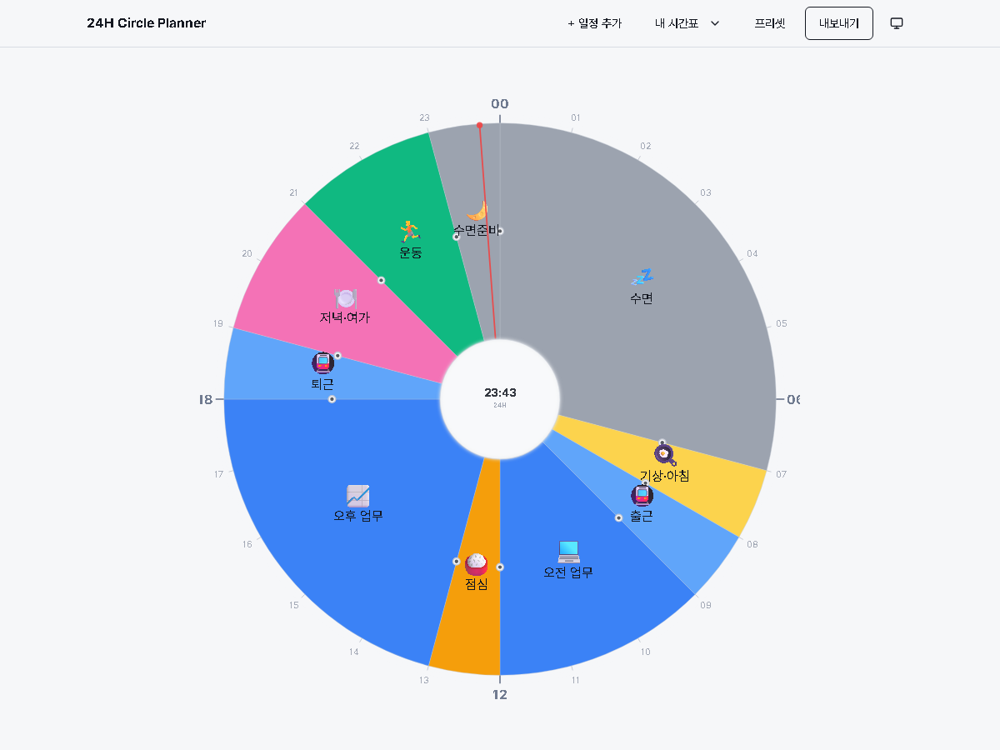

# 24H Circle Planner — 24시간 원형 라이프 시간표

하루 24시간을 **피자 형태의 원형 파이 차트**로 시각화하고 관리하는 클라이언트 전용 웹 앱입니다.
라이프스타일별 프리셋으로 빠르게 시작하고, 슬라이스를 직접 분할·드래그·편집한 뒤 PNG·PDF·JSON으로 내보낼 수 있습니다.



## ✨ 주요 기능

- **원형 24시간 타임라인** — 정중앙 상단이 `00:00`, 하단이 `12:00`인 시계 구조. 중심에 실시간 시계 허브, 현재 시각을 가리키는 빨간 실선, 림에 00~23 전체 시각 표시.
- **직관적 인터랙션**
  - 빈 영역 클릭 / 헤더 `+ 일정 추가` → 일정 분할(추가)
  - 슬라이스 더블클릭 → 인라인 편집기(라벨·아이콘·색상·라벨 위치·분할·삭제)
  - 경계 핸들 드래그 → 10분 단위 시간 조절 (핸들이 드래그를 실시간 추종)
  - 경계 핸들 호버 → `+`(분할) / `−`(병합) 어포던스
  - `Ctrl+Z` / `Ctrl+Shift+Z` 실행취소·다시실행 (드래그 중에는 드래그 취소)
- **스마트 아이콘 추천** — 라벨 입력 시 한/영 사전(211개 항목) + Fuse.js 퍼지 매칭으로 이모지 자동 추천. 5종 프리셋의 47개 라벨 100% 매칭.
- **라이프스타일 프리셋 5종** — 학생 · 대학생 · 직장인 · 자영업자 · 은퇴자 (총 47 슬라이스).
- **명명 슬롯** — 여러 시간표를 이름 붙여 localStorage에 저장/불러오기 (최대 10개).
- **내보내기** — PNG(투명/4K 옵션) · PDF(A4 300DPI, 벡터 텍스트 + 래스터 글래스모피즘 하이브리드) · JSON(버전 봉투).
- **테마** — 라이트 / 다크 / 시스템 자동, Glassmorphism 톤.
- **완전 오프라인** — 서버·로그인·외부 호출 없음. localStorage에 자동 저장.

## 🧱 기술 스택

| 영역 | 선택 |
|------|------|
| 빌드 | Vite |
| 프레임워크 | React 19 + TypeScript (strict) |
| 스타일 | Tailwind CSS v4 + Shadcn UI |
| 시각화 | SVG 직접 제어 (viewBox 1000×1000) |
| 상태 | React Context + `use-context-selector` (히스토리/undo 포함) |
| 아이콘 추천 | Fuse.js + 한/영 이모지 사전 |
| 내보내기 | jsPDF + svg2pdf.js (PDF), Canvas (PNG) |
| 폰트 | Pretendard (OFL) |
| 테스트 | Vitest + fast-check (속성 테스트) + Playwright (file:// 검증) |

## 🚀 빠른 시작

```bash
pnpm install
pnpm dev            # 개발 서버 → http://localhost:5173
```

## 📦 빌드

```bash
pnpm build          # 정적 웹 빌드 → dist/  (메인 청크 ~153 KB gz)
pnpm preview        # 빌드 결과 미리보기 → http://localhost:4173
```

### 더블클릭 단일 파일 빌드

서버 없이 더블클릭으로 여는 자기완결형 HTML이 필요하면:

```bash
pnpm build:single   # → dist-single/index.html  (모든 JS/CSS/폰트 인라인, ~7.3 MB)
```

`dist-single/index.html` 한 파일만으로 어느 브라우저에서나 동작합니다 (폰트는 base64로 인라인되어 인터넷·서버 불필요). 자세한 운영 안내는 [`RUNBOOK.md`](RUNBOOK.md) 참고.

## 🧪 테스트

```bash
pnpm test                 # 전체 스위트 (341 tests)
pnpm test:coverage        # 커버리지 (src/lib ≥ 60%)
pnpm test:dict-coverage   # 프리셋 라벨 47/47 아이콘 사전 매칭 게이트
pnpm lint                 # ESLint
pnpm tsc --noEmit         # 타입 체크
```

## 🗂️ 구조

```
src/
  components/
    CircleTimeline/   # SVG 원형 렌더러 · 슬라이스 · 라벨 · 경계 핸들 · 현재시각 실선
    SliceEditor/      # 인라인 편집기 (라벨/아이콘/색상/분할/삭제)
    IconPicker/       # 카테고리별 이모지 선택 다이얼로그
    PresetGallery/    # 5종 프리셋 갤러리
    SlotSheet/        # 명명 슬롯 목록
    ExportPanel/      # PNG/PDF/JSON 내보내기
    ThemeToggle/
  lib/
    schedule.ts       # 순수 슬라이스 로직 (split/merge/resize, 연속성 불변식)
    time-utils.ts     # HH:mm ↔ 각도/분, isContiguous24h
    svg-geometry.ts   # 링 기하 (innerR=100, outerR=460), slicePath
    storage.ts        # localStorage 봉투 (버전 관리)
    slots.ts          # 명명 슬롯 저장소
    fuse-dict.ts      # 아이콘 추천
    export/           # png · pdf · jsonIo · 폰트 인라인 · 픽셀 diff
  hooks/
    useScheduleStore.tsx   # 스토어 (HistoryState + drag 상태)
    useSliceInteraction.ts # C10 드래그 격리 계약 (imperative DOM, 무리렌더)
    useKeyboardShortcuts.ts
  data/
    presets.ts        # 5종 프리셋 (47 슬라이스)
    icon-dictionary.ts# 211개 한/영 아이콘 항목
    fonts.ts          # Pretendard base64 (?inline) / TTF url (?url)
```

## 🎨 설계 메모

- **클라이언트 전용 SPA** — 백엔드·인증 없음. 모든 상태는 localStorage에 버전 봉투(`{ version, ... }`)로 저장하여 향후 마이그레이션 안전성 확보.
- **C10 드래그 격리 계약** — 경계 드래그 중에는 React 재렌더 없이 SVG `d` 속성과 핸들 위치를 imperative하게 갱신하여 60fps 인터랙션을 유지. 무관한 재렌더가 드래그 상태를 덮어쓰지 않도록 스냅샷 기반 셀렉터로 격리.
- **연속성 불변식(H7)** — 모든 슬라이스 변형 후 `isContiguous24h`를 검사하여 위반 시 되돌림. fast-check 속성 테스트(seed `0xC1C1E24`, 200런)로 무한 루프/깨짐을 상시 방지.
- **하이브리드 PDF** — Glassmorphism 배경은 300DPI 래스터, 슬라이스·텍스트는 벡터(svg2pdf)로 합성하여 인쇄 품질과 선택 가능한 텍스트를 모두 확보.

## 📄 라이선스

- 애플리케이션 코드: 자유롭게 사용하세요.
- 폰트: [Pretendard](https://github.com/orioncactus/pretendard) — SIL Open Font License 1.1.
